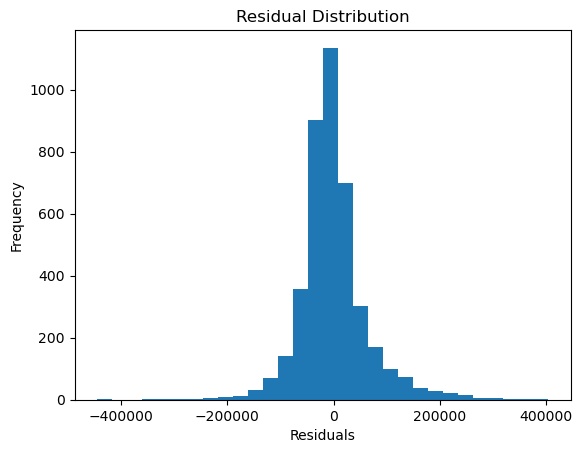

# 🌳 Decision Tree Regression – Housing Price Prediction


A machine learning regression project that uses a **Decision Tree Regressor** to predict housing prices, evaluated using **RMSE and R² score**, along with residual and prediction visualizations.

---

## 📌 Project Overview

This project implements a **Decision Tree Regression model** trained on a housing dataset to predict continuous target values. The model’s performance is evaluated using **Root Mean Squared Error (RMSE)** and **R² score**, and visual diagnostics are used to analyze prediction quality and residual distribution.

---

## 📁 Project Structure

Decisiontree_Regression  
│  
├── decision_treereg.ipynb  
├── housing.csv  
├── rmse_r2.png  
├── residual_distribution.png  
└── README.md  

---

## ⚙️ Technologies Used

- Python  
- NumPy  
- Pandas  
- Matplotlib  
- scikit-learn  
- Jupyter Notebook  

---

## 🧠 Machine Learning Model

- Algorithm: Decision Tree Regressor  
- Problem Type: Regression  
- Evaluation Metrics: RMSE, R² Score  

---

## 📈 Model Performance

The trained model achieved the following results on the test dataset:

- RMSE: 64428.72  
- R² Score: 0.6832  

These results indicate that the model explains approximately **68% of the variance** in the target variable.

---

## 📊 Visualizations

### Residual Distribution
The residual distribution plot helps analyze prediction errors and model bias.



### Actual vs Predicted Values
A visualization comparing y_test and y_pred is used to assess how closely predictions align with actual values.


---

## ▶️ How to Run

1. Clone the repository  
```text
git clone https://github.com/your-username/decision-tree-regression.git  
```

2. Install required libraries  
```text
pip install numpy pandas matplotlib scikit-learn  
```

3. Open decision_treereg.ipynb and run all cells sequentially  

---

## 🧪 Key Observations

- Decision Tree Regression captures non-linear relationships effectively  
- Residuals are centered around zero, indicating reasonable model fit  
- RMSE highlights prediction error magnitude in the target’s original scale  
- Model performance can vary depending on tree depth and parameters  

---

## 🚀 Future Improvements

- Hyperparameter tuning (max_depth, min_samples_split)  
- Compare with Linear Regression and Random Forest  
- Apply cross-validation for better generalization  
- Feature engineering to improve R² score  

---
